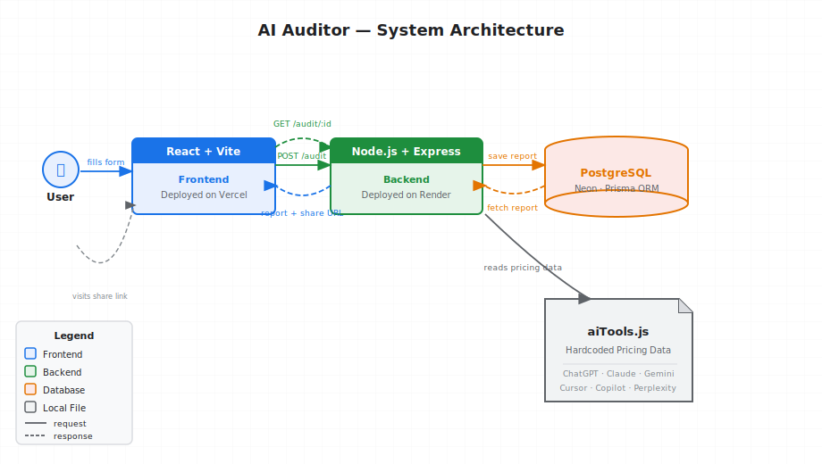

# AI Auditor

An AI subscription audit tool that detects overspending across your AI tools and recommends better plans.

🔗 **Live:** [ai-audit-seven-snowy.vercel.app](https://ai-audit-seven-snowy.vercel.app)

---

## Architecture



**Data Flow:**
1. User selects AI tools and their current plans on the frontend
2. Frontend sends subscription data to the Express backend via `POST /audit`
3. Backend reads hardcoded pricing data from `aiTools.js` and runs the audit logic
4. Audit result is saved to PostgreSQL (via Prisma); a unique share ID is generated via nanoid
5. Report + shareable URL is returned to the frontend
6. User can revisit any report via `GET /audit/:id`

---

## What It Does

- Accepts the user's current AI tool subscriptions and selected plans
- Compares plans against costs using **hardcoded, up-to-date pricing data**
- Detects overspending — flags plans where the user is paying more than needed
- Recommends a cheaper alternative **only if** it is also better suited for the use case
- Generates a per-tool breakdown with an overall audit verdict
- Creates a **unique shareable URL** for every audit report

---

## Supported AI Tools

ChatGpt
Claude
Gemini
Cursor
Github Copilot
Perplexity

> Pricing data is hardcoded in `aiTools.js` and reflects current USD pricing as of the time of writing.

---

## Tech Stack

| Layer | Technology |
|---|---|
| Frontend | React, Vite |
| Backend | Node.js, Express.js |
| Database | PostgreSQL (Neon) |
| ORM | Prisma |
| Pricing Data | Hardcoded — `aiTools.js` |
| Unique Report URLs | nanoid |
| Frontend Deployment | Vercel |
| Backend Deployment | Render |

---

## Local Setup

### Prerequisites
- Node.js v18+
- PostgreSQL database (or [Neon](https://neon.tech) free tier)

### 1. Clone

```bash
git clone https://github.com/bhumika019579/ai-audit.git
cd ai-audit
```

### 2. Backend

```bash
cd server
npm install
```

Create `server/.env`:

```env
DATABASE_URL=your_neon_postgres_connection_string
PORT=5000
```

```bash
npx prisma migrate dev
npm run dev
```

### 3. Frontend

```bash
cd ../client
npm install
```

Create `client/.env`:

```env
VITE_API_URL=http://localhost:5000
```

```bash
npm run dev
```

App runs at `http://localhost:5173`

